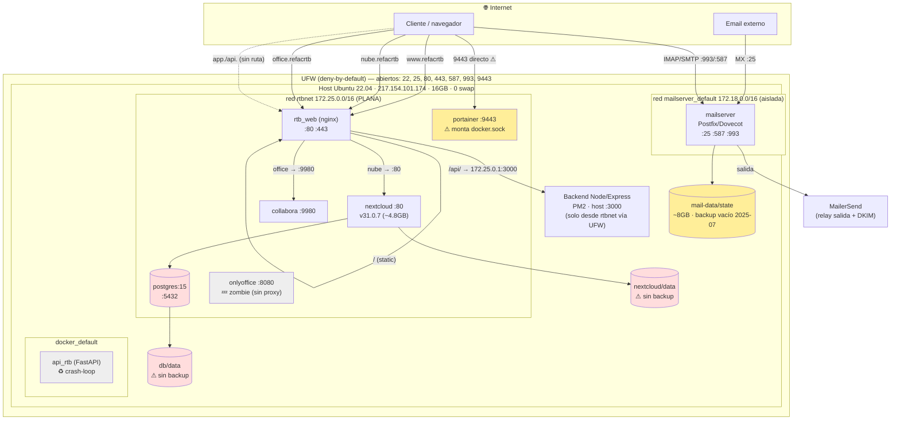
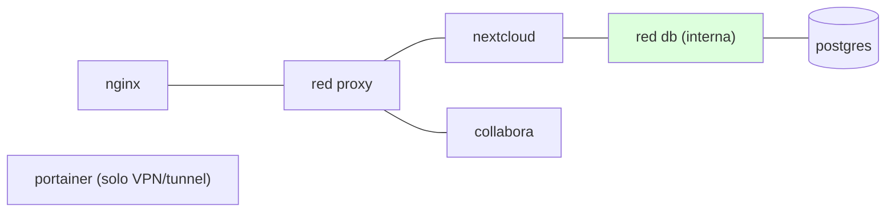

# Diagrama de arquitectura — RTB

> 2026-06-09 · refleja el estado **real** verificado (no el deseado)

## Petición: subdominio → proxy → contenedor → datos

## Mapa rápido subdominio → destino

| Subdominio | → | Destino real |
|---|---|---|
| www.refacrtb.com.mx | → | nginx (static) + `/api/` → Node :3000 |
| nube.refacrtb.com.mx | → | nginx → nextcloud:80 → postgres |
| office.refacrtb.com.mx | → | nginx → collabora:9980 |
| mail.refacrtb.com.mx | → | mailserver (MX/IMAP/SMTP) → relay MailerSend |
| app.refacrtb.com.mx | ✗ | sin ruta (onlyoffice zombie) |
| api.refacrtb.com.mx | ✗ | sin ruta (api_rtb crash-loop) |

## Segmentación objetivo (propuesta, ver PLAN-REFACTOR §7)

Hoy `postgres` y `portainer` están en la **misma** red que nginx (cara a internet). Objetivo: `postgres` solo alcanzable por `nextcloud` en una red `db` interna; `portainer` fuera de la red pública.
